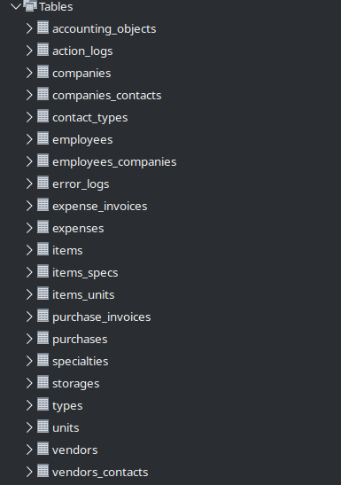

## Файл create_db_and_users.sql

Создаем базу, роли и пользователей.
База - medical_center_warehouse

Роли: 

    - аналитик(analyst) - имеет доступ только к аналитическим отчетам
    - администратор склада(warehouse_manager) - имеет полные права на операции со складом

Создаем конкертных пользователей и назначаем им роли

    - пользователь analyst с ролью analyst
    - пользователь warehouse_manager с ролью warehouse_manager
    - repl - пользователь для репликации

## Файл create_tables.sql

Создает таблицы базы medical_center_warehouse



## Файл create_indexes.sql

Создает индексы для полей таблиц

## Эффективность индексов

Запрос:

```sql
EXPLAIN ANALYZE SELECT * FROM items where name like '%шприц%';

-- Без индекса:
'-> Filter: (items.`name` like \'%шприц%\')  (cost=2054 rows=2202) (actual time=0.0243..15.3 rows=333 loops=1)\n
    -> Table scan on items  (cost=2054 rows=19818) (actual time=0.0179..9.05 rows=20005 loops=1)\n'

-- С fulltext индексом:
EXPLAIN ANALYZE SELECT * FROM items WHERE MATCH(name) AGAINST('шприц' IN NATURAL LANGUAGE MODE);

'-> Filter: (match items.`name` against (\'шприц\'))  (cost=0.35 rows=1) (actual time=0.0183..0.0186 rows=1 loops=1)\n
    -> Full-text index search on items using ft_items_name (name=\'шприц\')  (cost=0.35 rows=1) (actual time=0.0176..0.0178 rows=1 loops=1)n'
```

```sql
-- Запрос:
EXPLAIN ANALYZE SELECT * FROM items where comment like '%истек срок годности%';


-- Без индекса:
'-> Filter: (items.`comment` like \'%истек срок годности%\')  (cost=2054 rows=2202) (actual time=17.6..17.6 rows=0 loops=1)\n
    -> Table scan on items  (cost=2054 rows=19818) (actual time=0.0277..11.2 rows=20005 loops=1)\n'

-- С индексом:
EXPLAIN ANALYZE SELECT * FROM items WHERE MATCH(comment) AGAINST('истек срок годности' IN NATURAL LANGUAGE MODE);

'-> Filter: (match items.`comment` against (\'истек срок годности\'))  (cost=0.35 rows=1) (actual time=0.00522..0.00522 rows=0 loops=1)\n
    -> Full-text index search on items using ft_items_comment (comment=\'истек срок годности\')  (cost=0.35 rows=1) (actual time=0.00477..0.00477 rows=0 loops=1)\n'
```

```sql
-- Запрос:

EXPLAIN ANALYZE SELECT * FROM items WHERE type_id = 5  AND deleted_at IS NULL;

-- Без индекса:
'-> Filter: ((items.type_id = 5) and (items.deleted_at is null))  (cost=2054 rows=330) (actual time=0.0158..8.97 rows=3332 loops=1)\n
    -> Table scan on items  (cost=2054 rows=19818) (actual time=0.00804..8.17 rows=20005 loops=1)\n'

-- С индексом:
'-> Index lookup on items using idx_items_type_id_deleted_at (type_id=5, deleted_at=NULL), with index condition: (items.deleted_at is null)  (cost=550 rows=3332) (actual time=0.017..3.54 rows=3332 loops=1)\n'
```