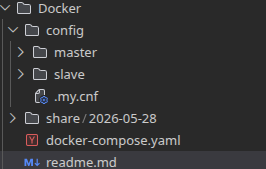

## Включает в себя конфигурацию при помощи которой разворачивается проект (docker-compose.yml)

### Makefile

Команды выполняются из папки `Docker`:

| Команда | Описание |
|---------|----------|
| `make up` | Разворачивает проект (`docker compose up -d --build`) |
| `make down` | Останавливает проект (`docker compose down`) |
| `make down-clear` | Останавливает проект и удаляет volumes (`docker compose down -v`) |
| `make bash-master` | Войти в контейнер `master` под пользователем `root` |
| `make bash-slave` | Войти в контейнер `slave` под пользователем `root` |

### Папка config включает в себя конфиги и sql скрипты для инициализации стартового состояния проекта

#### Папка master

Включает в себя:

>папку init. В этой папке находятся sql скрипты которые выполняются в момент разворачивания проекта:

- 01-create_tables_and_db - создает базу данных и все таблицы
- 02-create_indexes - вешает все индексы
- 03-db_seeding - заполняет базу тестовыми данными
- 04-db_seeding_procedure - создает процедуру генерации тестовых данных для номенклатуры
- 05-analitic_procedures - создает процедуры с отчетами
- 06-items_procedures - создает процедуры для номенклатуры
- 07-purchase_invoices_procedures - создает процедуры для приходных накладных
- 08-expense_invoices_procedures - создает процедуры для расходных накладных
- 09-expenses_procedures - создает процедуры для расходов
- 10-purchases_procedures - создает процедуры для приходов
- 11-create_db_and_users - создает роли и пользователей

>файл master.cnf. Содержит конфигурция мастер сервера mysql

#### Папка slave
>файл salve.cnf. Содержит конфигурция slave сервера mysql

>файл init/init_replication.sql содержит скрипт для старта репликации(запускается вручную со слейв сервера)

#### Файл .my.cnf

> Нужен для автовхода под рутом в mysql

#### Папка share

> Общая папка контейнеров, через которую работаю с бэкапами

