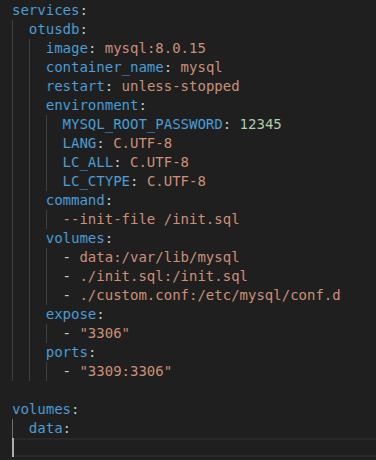
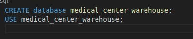
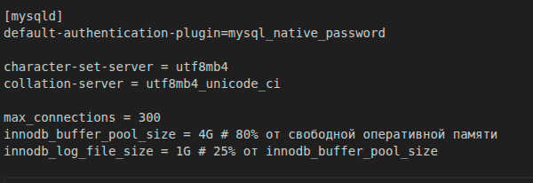
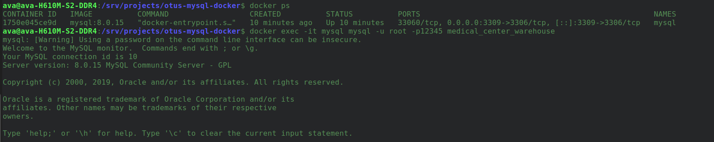
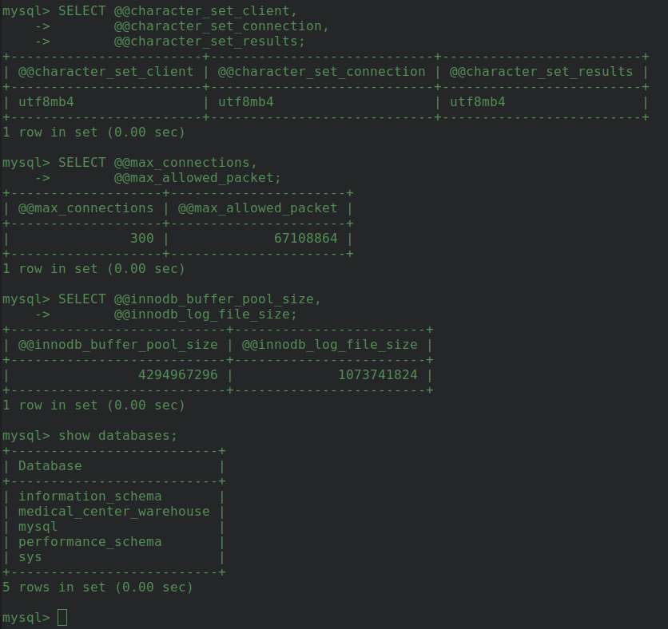

### Создаем базу данных MySQL в докере

Что было сделано:

1. Клонировал репозиторий из https://github.com/aeuge/otus-mysql-docker
2. Провел дополнительную настройку файлов:

>docker-compose.yml

    
    
>init.sql

>my.cnf 

3. Развернул контейнер
4. Проверил что настройки конфигурационного файла действуют

