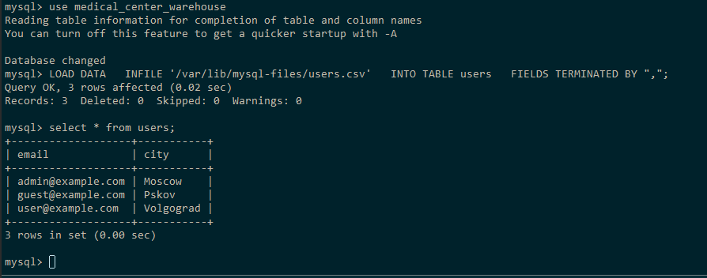

# Транзакции, MVCC, ACID в MySQL

## Описать пример транзакции из своего проекта с изменением данных в нескольких таблицах. Реализовать в виде хранимой процедуры.

```sql
-- Создание приходной накладной. Запись в 2 таблицы:
--  - таблица накладных
--  - таблица приходов

CREATE DEFINER=`root`@`%` PROCEDURE `createPuchase`(
	p_document_number VARCHAR(50), 
	p_date DATETIME,
	p_provider_id INT,
	p_employee_id INT,
	p_company_id INT,
	p_storage_id INT,
    p_amount INT,
    p_price DECIMAL(10,2),
    p_nomenclature_id INT
)
BEGIN
	DECLARE EXIT HANDLER FOR SQLEXCEPTION
	BEGIN
		ROLLBACK;
		SELECT 'Ошибка: операция отменена' AS error_message;
	END;
    
	START TRANSACTION;
    
    INSERT INTO purchase_invoices(document_number, date, provider_id, employee_id, company_id, storage_id)
    VALUES(p_document_number, p_date, p_provider_id, p_employee_id, p_company_id, p_storage_id);
    
	INSERT INTO parishes(amount, price, nomenclature_id, purchase_invoice_id)
    VALUES(p_amount, p_price, p_nomenclature_id, LAST_INSERT_ID());
    
    COMMIT;
    
    SELECT 'Успешно: накладная и товар добавлены' AS success_message;
END
```

## Загрузить данные из приложенных в материалах csv. Реализовать следующими путями: LOAD DATA

У меня по умолчанию был отключен secure_file_priv, включал его через my.cnf

