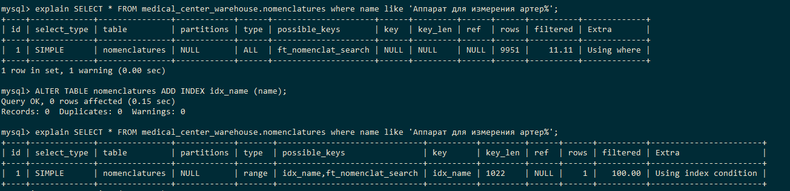
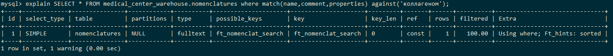
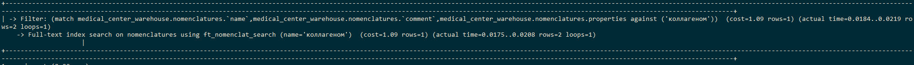

# Индексы в mysql

## Добавляем или обновляем индексы

> В проекте нету индексов, добавляю с нуля

```sql
-- 1. Таблица nomenclatures
ALTER TABLE nomenclatures ADD INDEX idx_name (name);
ALTER TABLE nomenclatures ADD INDEX idx_type_id (type_id);
ALTER TABLE nomenclatures ADD INDEX idx_speciality_id (speciality_id);
ALTER TABLE nomenclatures ADD INDEX idx_type_speciality (type_id, speciality_id);

-- 2. Таблица types
ALTER TABLE types ADD INDEX idx_name (name);

-- 3. Таблица specialties
ALTER TABLE specialties ADD INDEX idx_name (name);

-- 4. Таблица units
ALTER TABLE units ADD INDEX idx_name (name);

-- 5. Таблица purchase_invoices
ALTER TABLE purchase_invoices ADD INDEX idx_provider_id (provider_id);
ALTER TABLE purchase_invoices ADD INDEX idx_employee_id (employee_id);
ALTER TABLE purchase_invoices ADD INDEX idx_company_id (company_id);
ALTER TABLE purchase_invoices ADD INDEX idx_storage_id (storage_id);
ALTER TABLE purchase_invoices ADD INDEX idx_company_storage (company_id, storage_id);
ALTER TABLE purchase_invoices ADD INDEX idx_date (date);

-- 6. Таблица parishes
ALTER TABLE parishes ADD INDEX idx_nomenclature_id (nomenclature_id);
ALTER TABLE parishes ADD INDEX idx_purchase_invoice_id (purchase_invoice_id);
ALTER TABLE parishes ADD INDEX idx_invoice_nomenclature (purchase_invoice_id, nomenclature_id);

-- 7. Таблица providers
ALTER TABLE providers ADD INDEX idx_name (name);
ALTER TABLE providers ADD INDEX idx_inn (inn);

-- 8. Таблица employees
ALTER TABLE employees ADD INDEX idx_name (name);
ALTER TABLE employees ADD INDEX idx_address (address);
ALTER TABLE employees ADD INDEX idx_email (email);
ALTER TABLE employees ADD INDEX idx_phone (phone);

-- 9. Таблица companies
ALTER TABLE companies ADD INDEX idx_name (name);
ALTER TABLE companies ADD INDEX idx_inn (inn);

-- 10. Таблица storages
ALTER TABLE storages ADD INDEX idx_name (name);
ALTER TABLE storages ADD INDEX idx_company_id (company_id);

-- 11. Таблица storage_structures
ALTER TABLE storage_structures ADD INDEX idx_parent_id (parent_id);
ALTER TABLE storage_structures ADD INDEX idx_child_id (child_id);
ALTER TABLE storage_structures ADD INDEX idx_parent_child (parent_id, child_id);

-- 12. Таблица accounting_object
ALTER TABLE accounting_objects ADD INDEX idx_name (name);

-- 13. Таблица expense_invoices
ALTER TABLE expense_invoices ADD INDEX idx_accounting_object_id (accounting_object_id);
ALTER TABLE expense_invoices ADD INDEX idx_storage_id (storage_id);
ALTER TABLE expense_invoices ADD INDEX idx_date (date);

-- 14. Таблица cancellations
ALTER TABLE cancellations ADD INDEX idx_nomenclature_id (nomenclature_id);
ALTER TABLE cancellations ADD INDEX idx_expense_invoice_id (expense_invoice_id);
ALTER TABLE cancellations ADD INDEX idx_invoice_nomenclature (expense_invoice_id, nomenclature_id);

-- УДАЛЕНИЕ ИНДЕКСОВ
/*
ALTER TABLE nomenclatures DROP INDEX idx_name;
ALTER TABLE nomenclatures DROP INDEX idx_type_id;
ALTER TABLE nomenclatures DROP INDEX idx_speciality_id;
ALTER TABLE nomenclatures DROP INDEX idx_type_speciality;

ALTER TABLE types DROP INDEX idx_name;
ALTER TABLE specialities DROP INDEX idx_name;
ALTER TABLE units DROP INDEX idx_name;

ALTER TABLE purchase_invoices DROP INDEX idx_provider_id;
ALTER TABLE purchase_invoices DROP INDEX idx_employee_id;
ALTER TABLE purchase_invoices DROP INDEX idx_company_id;
ALTER TABLE purchase_invoices DROP INDEX idx_storage_id;
ALTER TABLE purchase_invoices DROP INDEX idx_company_storage;
ALTER TABLE purchase_invoices DROP INDEX idx_date;

ALTER TABLE parishes DROP INDEX idx_nomenclature_id;
ALTER TABLE parishes DROP INDEX idx_purchase_invoice_id;
ALTER TABLE parishes DROP INDEX idx_invoice_nomenclature;

ALTER TABLE providers DROP INDEX idx_name;
ALTER TABLE providers DROP INDEX idx_inn;

ALTER TABLE employees DROP INDEX idx_name;
ALTER TABLE employees DROP INDEX idx_address;
ALTER TABLE employees DROP INDEX idx_email;
ALTER TABLE employees DROP INDEX idx_phone;

ALTER TABLE companies DROP INDEX idx_name;
ALTER TABLE companies DROP INDEX idx_inn;

ALTER TABLE storages DROP INDEX idx_name;
ALTER TABLE storages DROP INDEX idx_company_id;

ALTER TABLE storage_structures DROP INDEX idx_parent_id;
ALTER TABLE storage_structures DROP INDEX idx_child_id;
ALTER TABLE storage_structures DROP INDEX idx_parent_child;

ALTER TABLE accounting_object DROP INDEX idx_name;

ALTER TABLE expense_invoices DROP INDEX idx_accounting_object_id;
ALTER TABLE expense_invoices DROP INDEX idx_storage_id;
ALTER TABLE expense_invoices DROP INDEX idx_date;

ALTER TABLE cancellations DROP INDEX idx_nomenclature_id;
ALTER TABLE cancellations DROP INDEX idx_expense_invoice_id;
ALTER TABLE cancellations DROP INDEX idx_invoice_nomenclature;
*/
```
## explain и результаты выборки без индекса и с индексом.



## Реализация полнотекстового индекса
> Задача - сделать полнотекстовый индекс, который ищет по свойствам, названию товара и описанию. Если нет аналогичной задачи в проекте - имитируем.
> Всех подходящих полей нету - имитирую:

```sql
ALTER TABLE nomenclatures ADD column properties TEXT;

ALTER TABLE nomenclatures add FULLTEXT INDEX ft_nomenclat_search(name,comment,properties);

-- Пробуем сделать запрос:
SELECT * FROM nomenclatures
WHERE MATCH(name,comment,properties) AGAINST('коллагеном');
 ```

 EXPLAIN:
 

 EXPLAIN ANALYZE
 

