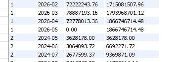
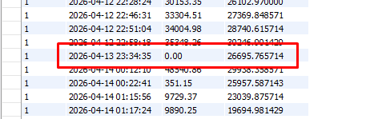

## Напишите хранимую процедуру со следующей функциональностью:

сгенерировать 10 магазинов в таблице stores

сгенерировать 100000 продаж в таблице sales за последние 2 года

продажи должны быть распределены НЕРАВНОМЕРНО между магазинами (70-75% продаж должны быть в каком-то одном магазине)

```sql
CREATE DEFINER=`root`@`%` PROCEDURE `store_generator`()
BEGIN
    DECLARE i INT DEFAULT 0;
    DECLARE random_store_id BIGINT UNSIGNED;
    DECLARE random_date TIMESTAMP;
    DECLARE random_amount DECIMAL(10,2);
    DECLARE store1_id BIGINT UNSIGNED;
    DECLARE current_day DATE;
    DECLARE second_offset INT;
    DECLARE used_seconds_str LONGTEXT;
    DECLARE found INT DEFAULT 1;
    
    TRUNCATE TABLE stores;
    TRUNCATE TABLE sales;
    
    INSERT INTO stores (address) VALUES
    ('г. Москва, ул. Тверская, 15'),
    ('г. Москва, пр-т Мира, 25'),
    ('г. Москва, ул. Арбат, 42'),
    ('г. Санкт-Петербург, Невский пр-т, 10'),
    ('г. Санкт-Петербург, ул. Садовая, 5'),
    ('г. Екатеринбург, ул. Ленина, 50'),
    ('г. Новосибирск, Красный пр-т, 30'),
    ('г. Казань, ул. Баумана, 20'),
    ('г. Нижний Новгород, ул. Большая Покровская, 15'),
    ('г. Челябинск, пр-т Ленина, 100');
    
    SELECT store_id INTO store1_id FROM stores LIMIT 1;
    
    START TRANSACTION;
    
    CREATE TEMPORARY TABLE IF NOT EXISTS temp_used_day (
        store_id BIGINT UNSIGNED,
        sale_date DATE,
        used_seconds LONGTEXT,
        PRIMARY KEY (store_id, sale_date)
    );
    
    WHILE i < 100000 DO
        -- Распределение магазинов: 75% продаж в первом магазине
        IF RAND() < 0.75 THEN
            SET random_store_id = store1_id;
        ELSE
            SET random_store_id = 1 + FLOOR(RAND() * 10);
        END IF;
        
        SET current_day = DATE_SUB(CURDATE(), INTERVAL FLOOR(RAND() * 730) DAY);
        
        IF NOT EXISTS (SELECT 1 FROM temp_used_day WHERE store_id = random_store_id AND sale_date = current_day) THEN
            INSERT INTO temp_used_day (store_id, sale_date, used_seconds) VALUES (random_store_id, current_day, '');
        END IF;
        
        SELECT used_seconds INTO used_seconds_str
        FROM temp_used_day
        WHERE store_id = random_store_id AND sale_date = current_day;
        
        SET found = 1;
        WHILE found > 0 DO
            SET second_offset = FLOOR(RAND() * 86400);
            SET found = IF(used_seconds_str = '' OR FIND_IN_SET(second_offset, used_seconds_str) = 0, 0, 1);
        END WHILE;
        
        UPDATE temp_used_day 
        SET used_seconds = CONCAT(used_seconds, IF(used_seconds = '', '', ','), second_offset)
        WHERE store_id = random_store_id AND sale_date = current_day;
        
        SET random_date = TIMESTAMP(current_day) + INTERVAL second_offset SECOND;
        
        SET random_amount = 100 + RAND() * 49900;
        
        INSERT INTO sales (store_id, date, sale_amount)
        VALUES (random_store_id, random_date, random_amount);
        
        SET i = i + 1;
        
        IF i % 1000 = 0 THEN
            COMMIT;
            START TRANSACTION;
        END IF;
    END WHILE;
    
    DROP TEMPORARY TABLE IF EXISTS temp_used_day;
    COMMIT;
END
```

## Напишите запрос, который выведет нарастающий итог продаж по каждому магазину с группировкой по месяцам

> Граничный случай: если в какой-то из месяцев мы имеем нулевые продажи, то месяц все равно будет включен в выборку и будет выведен 0

```sql
-- Все месяцы за указанный период
WITH RECURSIVE months AS (
    SELECT '2024-05' AS month
    UNION ALL
    SELECT DATE_FORMAT(DATE_ADD(STR_TO_DATE(CONCAT(month, '-01'), '%Y-%m-%d'), INTERVAL 1 MONTH), '%Y-%m')
    FROM months
    WHERE month < '2026-05'
),
-- Все возможные комбинации магазинов и месяцев
all_combinations AS (
    SELECT 
        s.store_id,
        m.month
    FROM (SELECT DISTINCT store_id FROM cte.sales) s
    CROSS JOIN months m
),
-- Агрегированные продажи по месяцам
monthly_sales AS (
    SELECT 
        store_id,
        DATE_FORMAT(date, '%Y-%m') AS month,
        SUM(sale_amount) AS amount
    FROM cte.sales
    GROUP BY store_id, DATE_FORMAT(date, '%Y-%m')
)

SELECT 
    ac.store_id,
    ac.month,
    COALESCE(ms.amount, 0) AS amount,
    SUM(COALESCE(ms.amount, 0)) OVER (
        PARTITION BY ac.store_id 
        ORDER BY ac.month
    ) AS cumulative_amount
FROM all_combinations ac
LEFT JOIN monthly_sales ms 
    ON ms.store_id = ac.store_id 
    AND ms.month = ac.month
ORDER BY ac.store_id, ac.month;
```



## Напишите запрос, который выведет 7-дневное скользящее среднее за последний месяц по самому плодовитому магазину.

> Граничный случай: если за какой-то день нету продаж, то день будет все равно включен в выборку с нулевой суммой

```sql
WITH 
-- 1. Суммарные продажи по магазинам
store_total AS (
    SELECT 
        store_id,
        SUM(sale_amount) AS total_sales
    FROM cte.sales
    GROUP BY store_id
),
-- 2. Ранжируем магазины
store_rank AS (
    SELECT 
        store_id,
        total_sales,
        DENSE_RANK() OVER (ORDER BY total_sales DESC) AS rank1
    FROM store_total
),
-- 3.Оставляем самый плодовитый магазин
top_store_id AS (
    SELECT store_id FROM store_rank WHERE rank1 = 1 LIMIT 1
),
-- 4. Все дни за последний месяц
last_month_days AS (
    WITH RECURSIVE date_range AS (
        SELECT 
            DATE_SUB(
                (SELECT MAX(date) FROM cte.sales), 
                INTERVAL 30 DAY
            ) AS dt
        UNION ALL
        SELECT dt + INTERVAL 1 DAY
        FROM date_range
        WHERE dt < (SELECT MAX(date) FROM cte.sales)
    )
    SELECT dt AS full_date, DATE(dt) AS date_only FROM date_range
),
-- 5. Продажи топ-магазина
top_store_sales AS (
    SELECT 
        store_id,
        date AS sale_datetime,
        DATE(date) AS sale_date,
        sale_amount
    FROM cte.sales
    WHERE store_id = (SELECT store_id FROM top_store_id)
),
-- 6. Объединяем реальные продажи + дни без продаж
all_sales_with_zeros AS (
    -- Реальные продажи
    SELECT 
        store_id,
        sale_datetime AS date,
        sale_amount
    FROM top_store_sales
    
    UNION ALL
    
    -- Дни без продаж 
    SELECT 
        (SELECT store_id FROM top_store_id) AS store_id,
        d.full_date AS date,
        0 AS sale_amount
    FROM last_month_days d
    WHERE NOT EXISTS (
        SELECT 1 
        FROM top_store_sales t 
        WHERE t.sale_date = d.date_only
    )
)

SELECT 
    store_id,
    date,
    sale_amount,
    AVG(sale_amount) OVER (
        PARTITION BY store_id 
        ORDER BY date 
        ROWS BETWEEN 6 PRECEDING AND CURRENT ROW
    ) AS seven_day_sliding
FROM all_sales_with_zeros
WHERE DATE_FORMAT(date, '%Y-%m') = (
    SELECT DATE_FORMAT(MAX(date), '%Y-%m') FROM cte.sales
)
ORDER BY date;
```
