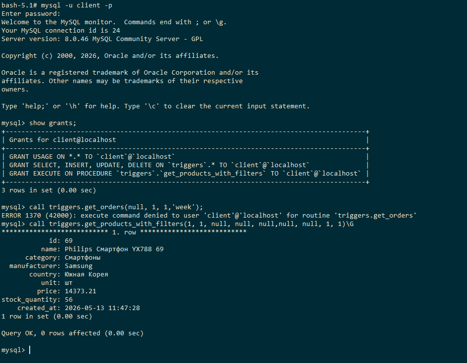
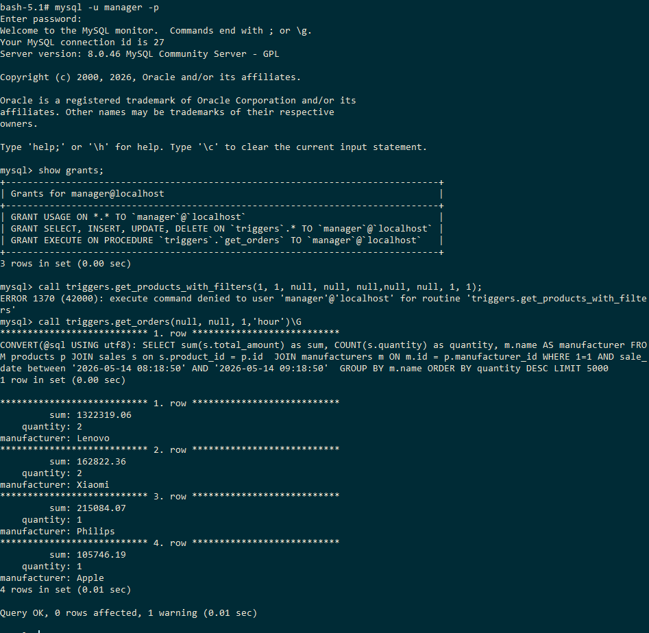
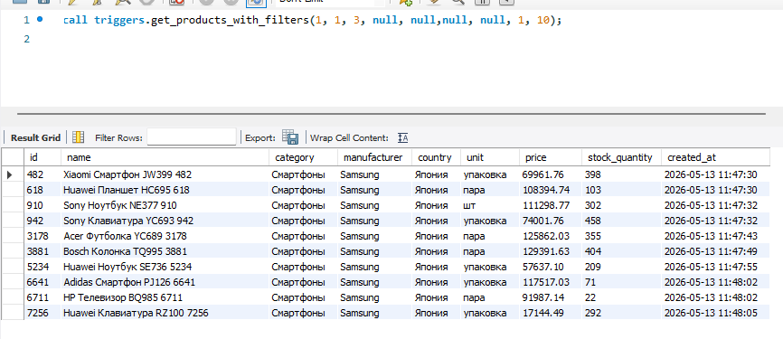
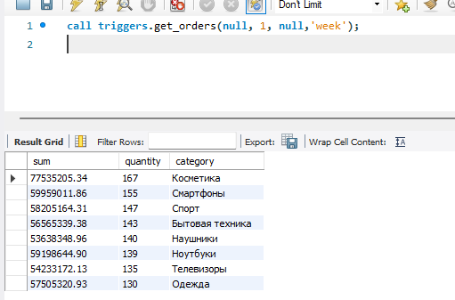

## Создать пользователей client, manager

>Создал пользователей. Дал им права на чтение и запись, а также чтобы каждый пользователь мог выполнять только свою процедуру.

>client может работать только с процедурой выборки товаров: get_products_with_filters.

>manager может работать только с процедурой отчета get_orders.

client:



manager:



## Создать процедуру выборки товаров с использованием различных фильтров: категория, цена, производитель, различные дополнительные параметры

Процедура с фильтрам по
- категории 
- произволителю
- страны производства
- ед.измерения
- имени товара

Можно выставить сортировку и направление сортировки

Так же можно передать параметры пагинации (страница, размер страницы)


```sql
CREATE DEFINER=`client`@`localhost` PROCEDURE `get_products_with_filters`(
IN p_category_id INT,
IN p_manufacturer_id INT, 
IN p_country_id INT, 
IN p_unit_id INT,
IN p_name VARCHAR(100),
IN p_sort_column VARCHAR(50),
IN p_sort_direction VARCHAR(4),
IN p_page INT,
IN p_page_size INT
)
BEGIN
	DECLARE v_sort_column VARCHAR(50);
    DECLARE v_sort_direction VARCHAR(4);
	DECLARE v_page INT;
    DECLARE v_page_size INT;
    DECLARE v_offset INT;
    
    SET v_sort_column = CASE
		WHEN p_sort_column = 'id' THEN 'p.id'
        WHEN p_sort_column = 'category' THEN 'c.name'
        WHEN p_sort_column = 'manufacturer' THEN 'm.name'
        WHEN p_sort_column = 'country' THEN 'co.name'
        WHEN p_sort_column = 'price' THEN 'p.price'
        WHEN p_sort_column = 'quantity' THEN 'p.stock_quantity'
        WHEN p_sort_column = 'date' THEN 'p.created_at'
        ELSE 'p.id'
	END;
    
    SET v_sort_direction = CASE
		WHEN UPPER(p_sort_direction) = 'DESC' THEN 'DESC'
        ELSE 'ASC'
	END;
    
     SET v_page = CASE
        WHEN p_page IS NULL OR p_page < 1 THEN 1
        ELSE p_page
    END;

    SET v_page_size = CASE
        WHEN p_page_size IS NULL OR p_page_size < 1 THEN 20
        WHEN p_page_size > 1000 THEN 100
        ELSE p_page_size
    END;

    SET v_offset = (v_page - 1) * v_page_size;
    
	SET @sql = '
		SELECT
            p.id,
            p.name,
            c.name AS category,
            m.name AS manufacturer,
            co.name AS country,
            u.name AS unit,
            p.price,
            p.stock_quantity,
            p.created_at
        FROM products p
        JOIN categories c ON c.id = p.category_id
        JOIN manufacturers m ON m.id = p.manufacturer_id
        JOIN countries co ON co.id = p.country_id
        JOIN units u ON u.id = p.unit_id
        WHERE 1 = 1
    ';
    
    IF p_category_id IS NOT NULL THEN
       SET @sql = CONCAT(@sql, ' AND category_id = ', p_category_id);
	END IF;
    
    IF p_manufacturer_id IS NOT NULL THEN
        SET @sql = CONCAT(@sql, ' AND p.manufacturer_id = ', p_manufacturer_id);
    END IF;
    
	IF p_country_id IS NOT NULL THEN
        SET @sql = CONCAT(@sql, ' AND p.country_id = ', p_country_id);
    END IF;
    
	IF p_unit_id IS NOT NULL THEN
        SET @sql = CONCAT(@sql, ' AND p.unit_id = ', p_unit_id);
    END IF;
    
     IF p_name IS NOT NULL AND p_name <> '' THEN
        SET @sql = CONCAT(
            @sql,
            ' AND p.name LIKE ',
            QUOTE(CONCAT('%', p_name, '%'))
        );
    END IF;
    
    SET @sql = CONCAT(
        @sql,
        ' ORDER BY ', v_sort_column, ' ', v_sort_direction, 
        ' LIMIT ', v_page_size, 
        ' OFFSET ', v_offset
    );
    
    PREPARE stmt FROM @sql;
    EXECUTE stmt;
    DEALLOCATE PREPARE stmt;
    
END
```
Пример вывода:



## Создать процедуру get_orders - которая позволяет просматривать отчет по продажам за определенный период (час, день, неделя) с различными уровнями группировки (по товару, по категории, по производителю)

Процедура позволяет просмотреть отчет по продажам за выбранный период (hour,day,month)
Можно группировать по 3 полям (поля можно комбинировать между собой)

```sql
CREATE DEFINER=`manager`@`localhost` PROCEDURE `get_orders`(
IN p_group_by_product INT,
IN p_group_by_category INT,
IN p_group_by_manufacturer INT,
IN p_period VARCHAR(200)
)
BEGIN
	DECLARE v_period VARCHAR(200);
    
    SET v_period = CASE
		WHEN p_period = 'hour' THEN CONCAT(' sale_date between ', QUOTE(NOW() - INTERVAL 1 HOUR), ' AND ',  QUOTE(NOW()), ' ')
		WHEN p_period = 'day' THEN CONCAT(' sale_date >= ',   QUOTE(NOW() - INTERVAL 1 DAY), ' AND ',  QUOTE(NOW()), ' ')
        WHEN p_period = 'week' THEN CONCAT(' sale_date >= ', QUOTE(NOW() - INTERVAL 7 DAY), ' AND ',  QUOTE(NOW()), ' ')
        ELSE CONCAT(' sale_date >= ', QUOTE(NOW() - INTERVAL 1 DAY), ' AND ',  QUOTE(NOW()), ' ')
	END;
        
    SET @select_fields = 'sum(s.total_amount) as sum, COUNT(s.quantity) as quantity';
    SET @joins = 'JOIN sales s on s.product_id = p.id ';
    SET @group_by_fields = NULL;
    SET @period = NULL;
    SET @where_fields = 'WHERE 1=1 ';
        
	IF p_group_by_product IS NOT NULL THEN
        SET @select_fields = CONCAT_WS(', ', @select_fields, 'p.name AS product');
        SET @group_by_fields = CONCAT_WS(', ', @group_by_fields, 'p.name');
    END IF;

    IF p_group_by_category IS NOT NULL THEN
        SET @select_fields = CONCAT_WS(', ', @select_fields, 'c.name AS category');
        SET @joins = CONCAT(@joins, ' JOIN categories c ON c.id = p.category_id ');
        SET @group_by_fields = CONCAT_WS(', ', @group_by_fields, 'c.name');
    END IF;

    IF p_group_by_manufacturer IS NOT NULL THEN
        SET @select_fields = CONCAT_WS(', ', @select_fields, 'm.name AS manufacturer');
        SET @joins = CONCAT(@joins, ' JOIN manufacturers m ON m.id = p.manufacturer_id ');
        SET @group_by_fields = CONCAT_WS(', ', @group_by_fields, 'm.name');
    END IF;
    
    SET @where_fields = CONCAT(@where_fields, 'AND', v_period);

    SET @sql = CONCAT('SELECT ', @select_fields, ' FROM products p ', @joins, @where_fields);
    
    IF
		@group_by_fields IS NOT NULL THEN SET @sql = CONCAT(@sql, ' GROUP BY ', @group_by_fields);
    END IF;
    
    SET @sql = CONCAT(@sql, ' ORDER BY quantity DESC LIMIT 5000');
    SELECT CONVERT(@sql USING utf8);
    PREPARE stmt FROM @sql;
    EXECUTE stmt;
    DEALLOCATE PREPARE stmt;
END
```

Пример вывода:

