# Необходимо запустить репликацию двух серверов MySQL по топологии Source-Replica (Master-Slave)

## Запустить и показать работу асинхронной репликации на основе GTID

1. Запускаю проект через docker-compose файл. В нем есть 3 контейнера: 1 - мастер, 2 - слейв, 3 - xtrabackup

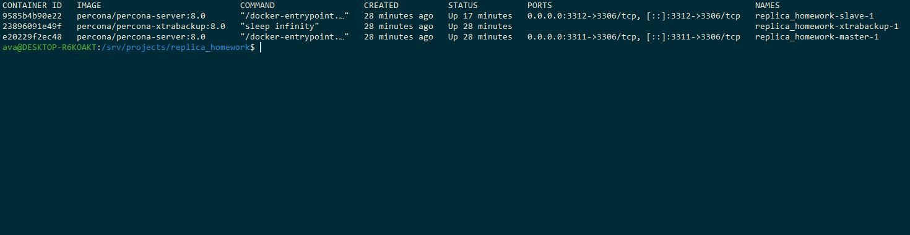

2. Захожу в мастер и реплику, проверяю какие сейчас там данные и что онии совпадают

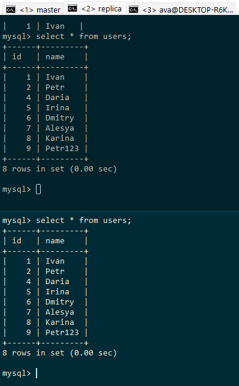

состояние одинаковое

3. Вставлю новые записи и проверяю чтобы на реплике они так же появились

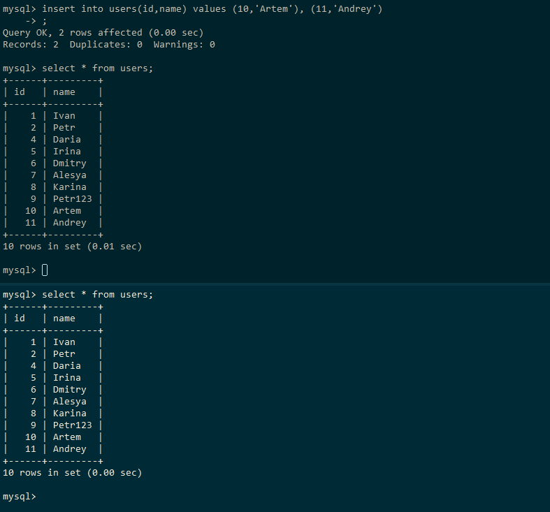

Видим что репликация работает

## Задание со звездочкой* Запустить реплику сразу с начальным данными (БД).

1. Для выполнение задачи запустим оба контейнера в начальном состоянии.
Начальное состояние:
    - Реплика:
        - имеет пустую базу
        - не запущена и не настроена
    - Мастер:
        - имеет тестовые данные (1 таблица, в ней 1 запись)
        - создан пользователь для выполнения репликации
    
    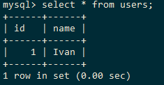

    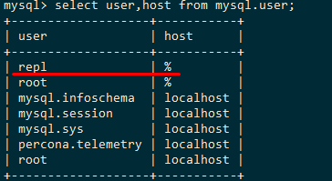

2. Делаю бэкап через xtrabackup. xtrrabackup у меня в отдельном контейнере
    - захожу в контейнер: 
    ```bash
    docker compose exec --user root xtrabackup bash
    ```
    - делаю бэкап
    ```bash
    xtrabackup --backup --target-dir=/backup/"$(date +%F)" --user=root --password='pass'
    ```
    - делаю prepare
    ```bash
    xtrabackup --prepare --target-dir=/backup/"$(date +%F)"
    ```
Подготовленный бэкап:

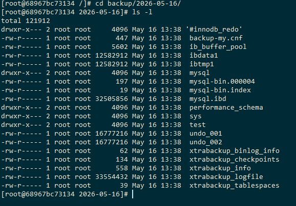

3. Вставляю новые данные на мастер
```sql
INSERT INTO users(id,name)
VALUES
(2,'Petr'),
(4,'Daria'),
(5,'Irina'),
(6,'Dmitry'),
(7,'Alesya'),
(8,'Karina');

SELECT * FROM users;
```

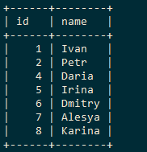

4. Восстанавливаюсь из бэкапа на реплике:

```bash
cd /var/lib/mysql
rm -rf *
cp -R /home/root/"$(date +%F)"/. /var/lib/mysql/

chown -R mysql:mysql /var/lib/mysql
```

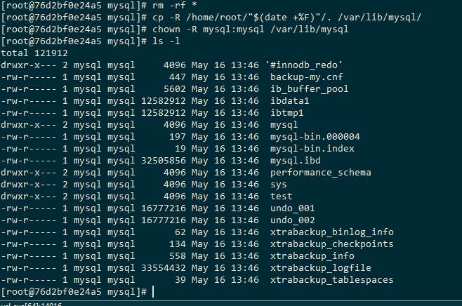

5. Перезапускаю контейнер:
```bash
docker compose restart slave
```
6. На реплике:
```sql
RESET SLAVE ALL;
```
```sql
CHANGE MASTER TO master_host='master', master_port=3306, master_user='repl',master_password='pass', 
MASTER_AUTO_POSITION = 1; 
```

```sql
START SLAVE; 
```

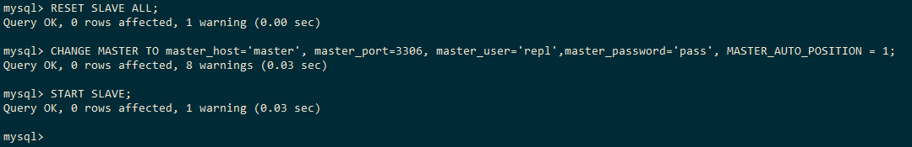

```sql
SHOW SLAVE STATUS\G 
```
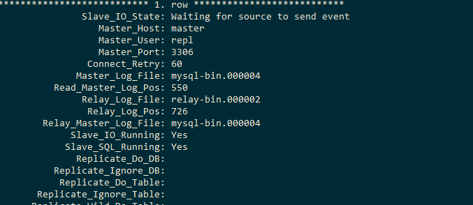

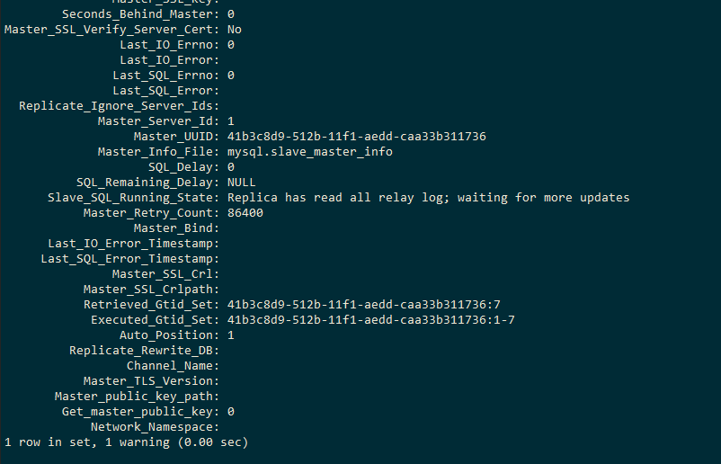

Репликация работает, проверяем данные в таблице:

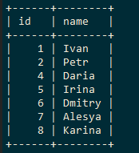

Видим что реплика догнала мастер

Попробуем вставить новые данные на мастер, и сразу же смотрим на реплику

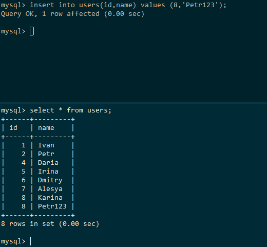

Конфигурация:
docker-compose.yml:
```yml
services:
  master:
    image: percona/percona-server:8.0
    environment:
        - MYSQL_ROOT_PASSWORD=pass
    volumes:
      - master_data:/var/lib/mysql
      - ./share:/home/root
      - ./config/master/master.cnf:/etc/mysql/my.cnf
      - ./config/.my.cnf:/root/.my.cnf
      - ./config/master/master-init.sql:/docker-entrypoint-initdb.d/master-init.sql
    ports:
      - "3311:3306"

  slave:
    image: percona/percona-server:8.0
    environment:
        - MYSQL_ROOT_PASSWORD=pass
    volumes:
      - slave_data:/var/lib/mysql
      - ./share:/home/root
      - ./config/slave/slave.cnf:/etc/mysql/my.cnf
      - ./config/.my.cnf:/root/.my.cnf
    ports:
      - "3312:3306"
  
  xtrabackup:
    image: percona/percona-xtrabackup:8.0
    volumes:
      - master_data:/var/lib/mysql
      - ./share:/backup
    entrypoint: ["sleep", "infinity"]
  
volumes:
  master_data:
  slave_data:
```

Конфиг для master:
```
[mysqld]
server_id=1

log_bin=mysql-bin.log

expire_logs_days        = 3
max_binlog_size         = 1G
sync_binlog             = 0

gtid_mode=ON
enforce_gtid_consistency=ON

bind-address=0.0.0.0
```

Конфиг для slave
```
[mysqld]
skip_slave_start

server_id=2

relay_log=relay-bin.log

gtid_mode=ON
enforce_gtid_consistency=ON

read_only=ON

bind-address=0.0.0.0
```

