# Необходимо развернуть кластер Percona XtraDB Cluster (PXC) или InnoDB Cluster.

## развернуть кластер из трех серверов (нод, узлов) и продемонстрировать его работу (предоставить статус кластера на каждой ноде)

Разоврачиваю через vagrant.

Мои конфиги:

Vagrantfile
```ruby
Vagrant.configure("2") do |config|
  config.vm.box = "ubuntu/focal64"
  config.vm.box_version = "20240821.0.1"

  nodes = {
  "pxc1" => ["10.0.26.201", 2201],
  "pxc2" => ["10.0.26.202", 2202],
  "pxc3" => ["10.0.26.203", 2203]
}

  nodes.each do |name, data|
    ip = data[0]
    ssh_port = data[1]

    config.vm.define name do |node|
      node.vm.hostname = name
      node.vm.network "private_network", ip: ip
      node.vm.network "forwarded_port", guest: 22, host: ssh_port, auto_correct: true

      node.vm.provider "virtualbox" do |vb|
        vb.memory = 1024
        vb.cpus = 1
      end

      node.vm.provision "shell", path: "install.sh", args: [name, ip]
      
    end
  end
end
```

install.sh скрипт для установки начального окружения:
```bash
#!/bin/bash
set -e

export DEBIAN_FRONTEND=noninteractive

apt update

wget -q https://repo.percona.com/apt/percona-release_latest.generic_all.deb
dpkg -i percona-release_latest.generic_all.deb

apt update
percona-release setup pxc80

echo "percona-server-server percona-server-server/root-pass password pass" | debconf-set-selections
echo "percona-server-server percona-server-server/re-root-pass password pass" | debconf-set-selections

apt install -y percona-xtradb-cluster


systemctl enable mysql
systemctl stop mysql
```

Устанавливаю одинаковые ключи для всех нод
```bash
-- on PXC1
mkdir -p /vagrant/ssl
cp /var/lib/mysql/{server-key,server-cert,ca}.pem /vagrant/ssl
chown -R vagrant:vagrant /vagrant/ssl

-- on PXC2
cp -r /vagrant/ssl/ /var/lib/mysql/
chown -R mysql:mysql /var/lib/mysql

-- on PXC3
cp -r /vagrant/ssl/ /var/lib/mysql/
chown -R mysql:mysql /var/lib/mysql
```

Настраиваю каждую ноду:
### Для  PXC1

```bash
sudo nano /etc/mysql/mysql.conf.d/mysqld.cnf
```

```bash
wsrep_cluster_address=gcomm://10.0.26.201,10.0.26.202,10.0.26.203
wsrep_node_address=10.0.26.201
wsrep_node_name=pxc1
```
```bash
sudo systemctl start mysql@bootstrap.service
```

### Для  PXC2

```bash
sudo nano /etc/mysql/mysql.conf.d/mysqld.cnf
```

```bash
wsrep_cluster_address=gcomm://10.0.26.201,10.0.26.202,10.0.26.203
wsrep_node_address=10.0.26.202
wsrep_node_name=pxc2
```

```bash
sudo systemctl start mysql
```

### Для  PXC3

```bash
sudo nano /etc/mysql/mysql.conf.d/mysqld.cnf
```

```bash
wsrep_cluster_address=gcomm://10.0.26.201,10.0.26.202,10.0.26.203
wsrep_node_address=10.0.26.203
wsrep_node_name=pxc3
```

```bash
sudo systemctl start mysql
```

Проверить что бы все 3 ноды были в кластере

wsrep_cluster_size должен быть равен трём

```mysql
> show status like 'wsrep%';
```


Смотрим статусы всех нод

Первая нода:
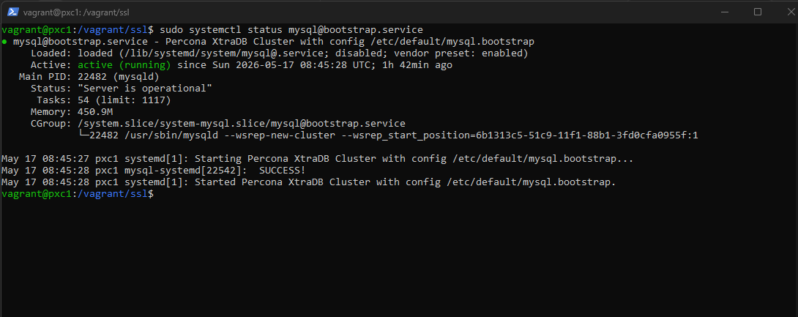

Вторая нода:
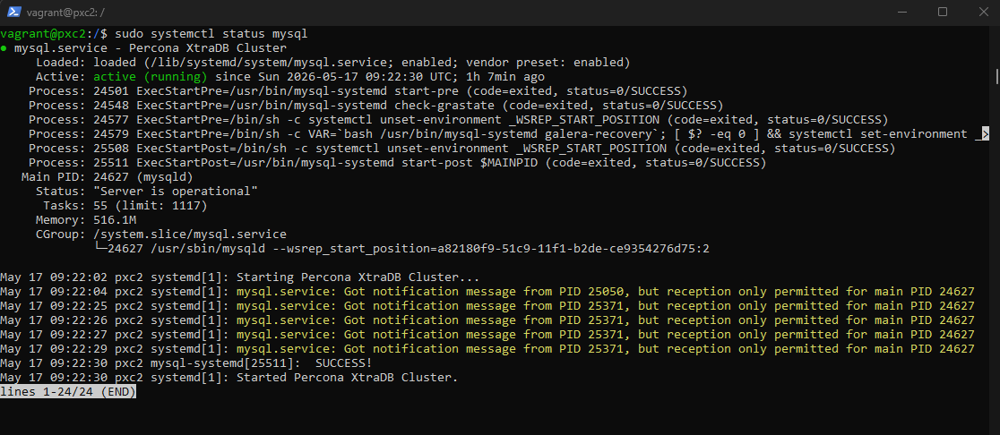

Третья нода:

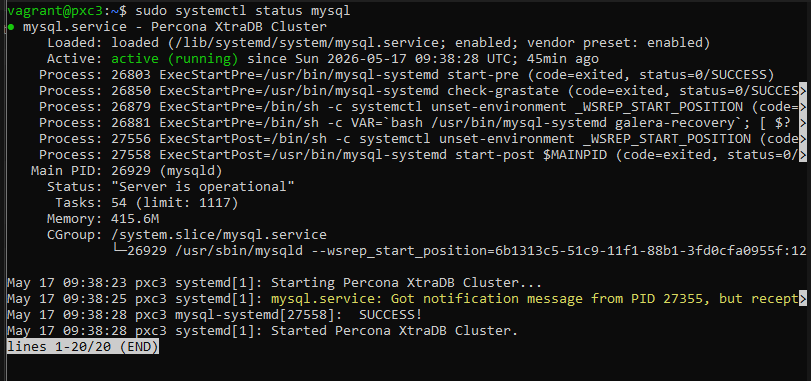

## загрузить данные и продемонстрировать содержимое БД (show tables и count одной из таблииц на каждой ноде)

Первая нода:

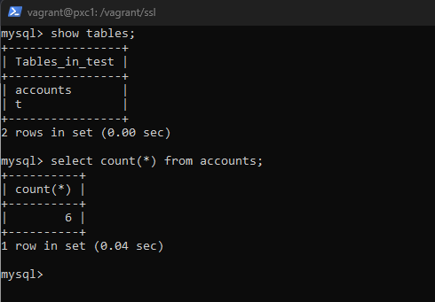

Вторая нода:

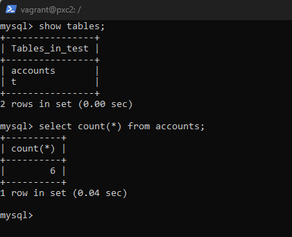

Третья нода:

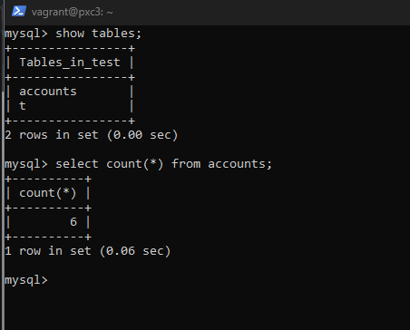

## Продемонстрировать работу кластера в режиме отказа одной из нод, при этом кластер должен продолжать работать и выполнять запросы.

1. Смотрим  первоначальное состояние кластера через 
```sql
show status like 'wsrep%';
```
У нас 3 ноды:


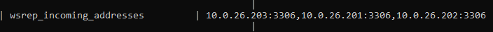

Отключаем одну(например вторую):
```bash
sudo service mysql stop
```

Проверяем кластер, видиим что осталось 2 ноды

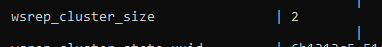


Вставляем новые данные через ProxySQL

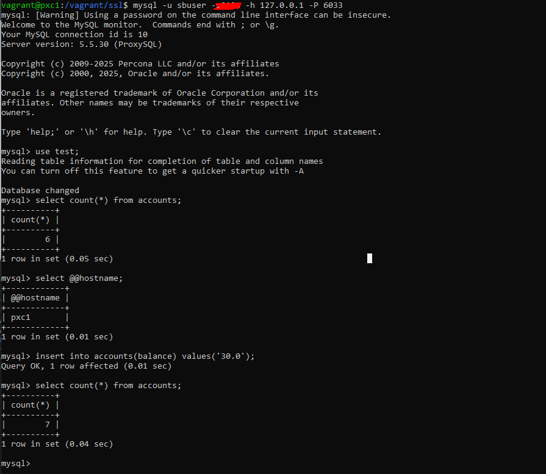

Зайдем вручную на 3 ноду, проверим, что данные синхронизировались

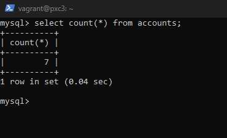

Включим 2 ноду и проверим чтобы данные туда так же подтянулись

```bash
sudo service mysql start
```

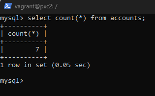

