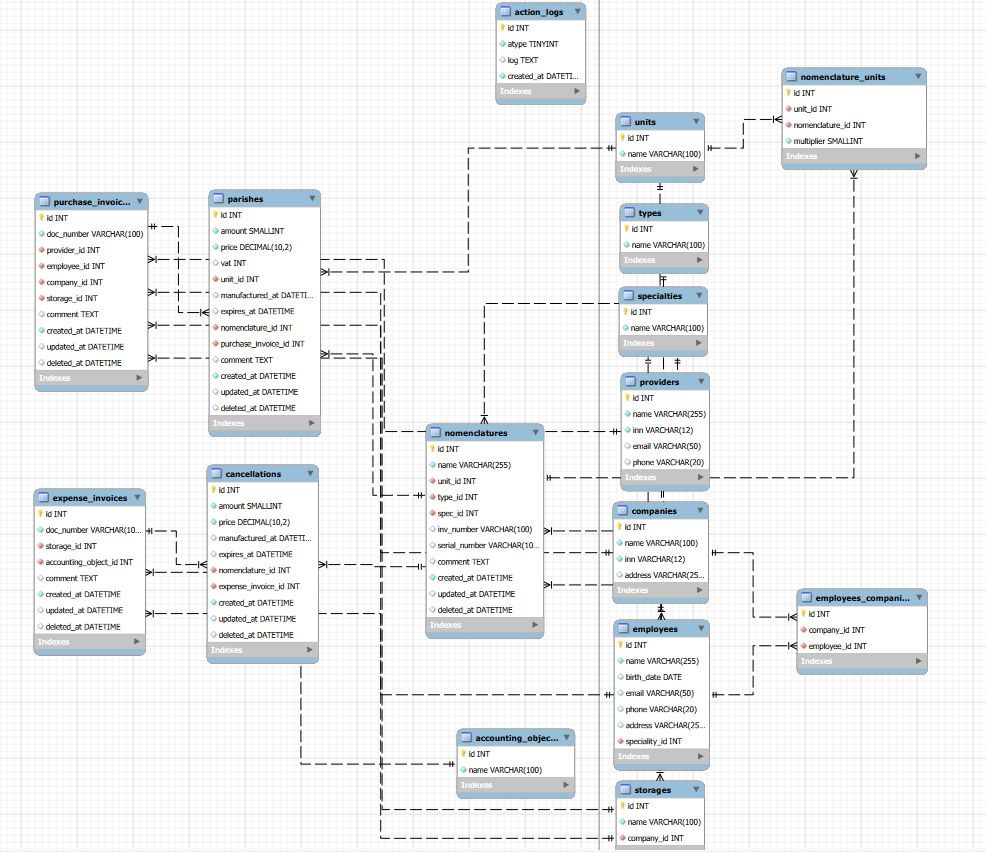

# Medical Center Warehouse

## Описание

Проект - склад медицинского центра.

Позволяет выполнять базовые складские операции для учета количества товаров на складах.

Схема базы данных проекта:

## Общая информация о сущностях:

#### Таблица Nomenclatures

>содержит в себе информацию о номенклатуре

#### Таблица Purchase Invoices

>содержит в себе информацию о приходных накладных

#### Таблица Parishes 

>содержит в себе информацию о приходах в рамках приходной накладной

#### Таблица Expense Invoices

>содержит в себе информацию о расходных накладных

#### Таблица Cancellations 

>содержит в себе информацию о расходах в рамках  расхдной накладной

#### Таблица Types

>содержит в себе информацию о типах номенклатуры 

#### Таблица unis 

>содержит в себе информацию о единицах измерения номенклатуры

#### Таблица Nomenclature Units

>содержит в себе информацию о том как конвертировать единицу измерения поставщика в единицу измерения номенклатуры.

#### Таблица Specialties

>содержит в себе информцию о специальности номенклатуры

#### Таблица Providers

>содержит в себе информвцию о поставщиках

#### Таблица Companies 

>содержит информацию о компаниях медицинской организации

#### Таблица Employees

>содержит информацию о сотрудниках организации

#### Таблица Employees Companies

>содержит информацию о том в каких организациях работают сотрудники

#### Таблица Storages

>содержит информацию о складах организации

#### Таблица Accounting Object

>содержит информацию об объектах учета (нужно только при списании)

#### Таблица Action Logs 

>содержит информацию о операциях "CREATE,UPDATE,DELETE" над сущностями "Nomenclatures, Purchase Invoices, Parishes, Expense Invoices, Cancellations"

