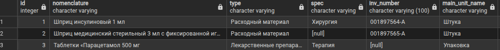
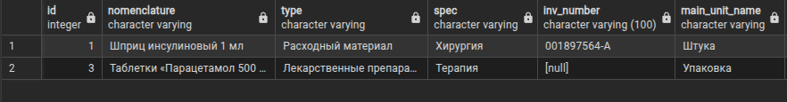
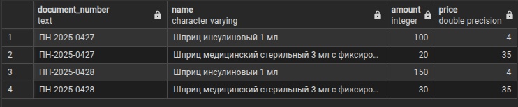
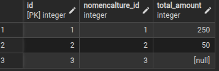
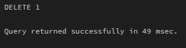
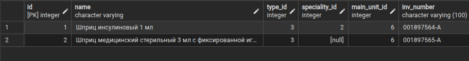

## 1. Напишите запрос по своей базе с регулярным выражением, добавьте пояснение, что вы хотите найти.

> Запрос с регулярным выражением который находит номера телефонов по шаблону +7 и далее 10 цифр

```
SELECT * FROM medical_center_warehouse.employees WHERE phone ~ '^\+7[0-9]{10}$';
```

## 2. Напишите запрос по своей базе с использованием LEFT JOIN и INNER JOIN, как порядок соединений в FROM влияет на результат? Почему?

>Запрос всей номенклатуры через inner и left join

>Через LEFT JOIN:
```
SELECT 
n.id, 
n.name AS nomenclature, 
t.name AS type, 
specs.name AS spec,
n.inv_number,
u_main.name AS main_unit_name,
n.expiration_date,
u_exp.name AS exp_unit_name, 
min_balance, max_balance,
n.comment 
FROM medical_center_warehouse.nomenclatures AS n
LEFT JOIN medical_center_warehouse.types AS t ON n.type_id = t.id
LEFT JOIN medical_center_warehouse.specialities AS specs ON n.speciality_id = specs.id
LEFT JOIN medical_center_warehouse.units AS u_main ON n.main_unit_id = u_main.id
LEFT JOIN medical_center_warehouse.units AS u_exp ON n.expiration_unit_id = u_exp.id
```


>Тот же запрос через INNER JOIN:
```
SELECT 
n.id, 
n.name AS nomenclature, 
t.name AS type, 
specs.name AS spec,
n.inv_number,
u_main.name AS main_unit_name,
n.expiration_date,
u_exp.name AS exp_unit_name, 
min_balance, max_balance,
n.comment 
FROM medical_center_warehouse.nomenclatures AS n
JOIN medical_center_warehouse.types AS t ON n.type_id = t.id
JOIN medical_center_warehouse.specialities AS specs ON n.speciality_id = specs.id
JOIN medical_center_warehouse.units AS u_main ON n.main_unit_id = u_main.id
JOIN medical_center_warehouse.units AS u_exp ON n.expiration_unit_id = u_exp.id
```


>Разница будет в том что во втором случае будут выведены только те позиции у которых каждая связь имеет запись в связанной таблице. В примере, у второго товара не проставлен тип, поэтому его нету во втором запросе.

>Список накладных и того что было оприходовано, в каком количестве и по какой цене. Через left join

```
SELECT pi.document_number, n.name, p.amount, p.price FROM medical_center_warehouse.purchase_invoices as pi
left join medical_center_warehouse.parishes as p on pi.id = p.purchase_invoice_id
left join medical_center_warehouse.nomenclatures as n on p.nomenclature_id = n.id
```

## 3. Напишите запросы на добавление данных с выводом информации о добавленных строках.

> Запросы на вставку данных во все таблицы c возвращением информации

```
INSERT INTO medical_center_warehouse.companies (name,inn) 
VALUES 
('Здоровье Плюс','7712345678'),
('Здоровье Премиум','7712345679')
returning id,name
```

```
INSERT INTO medical_center_warehouse.employees (name,address,email,phone) 
VALUES 
('Иванов Алексей Сергеевич','г. Москва, ул. Ленина, д. 45, кв. 12', 'a.ivanov1985@example.com', '79113257485'),
('Петрова Елена Дмитриевна','г. Екатеринбург, ул. Мира, д. 22, кв. 56', 'elena.petrova.spb@example.com', '79217784521'),
('Сидоров Михаил Андреевич','г. Санкт-Петербург, пр. Невский, д. 78, кв. 34', 'm.sidorov_ekb@example.com', '+79214126971')
returning id,name
```
```
INSERT INTO medical_center_warehouse.providers (name,inn) 
VALUES 
('ООО «МедТехСнаб»','7701234567'),
('ФармЛогистика Плюс','7702345678'),
('ООО «БиоХимТрейд»','7703456789')
returning id,name
```
```
INSERT INTO medical_center_warehouse.accounting_object (name) 
VALUES ('Стоматология'),('Хирургия')
returning id,name
```
```
INSERT INTO medical_center_warehouse.specialities (name) 
VALUES ('Стоматология'),('Хирургия'),('Терапия'),('Педиатрия'),('Урология')
returning id,name
```
```
INSERT INTO medical_center_warehouse.storages (name,company_id) 
VALUES 
('Общий',default),('Здоровье Плюс Склад',1),('Здоровье Премиум склад',2),('Склад техники',default)
returning id,name
```
```
INSERT INTO medical_center_warehouse.storages_structures (parent_id,child_id) 
VALUES 
(3,4)
returning parent_id,child_id
```
```
INSERT INTO medical_center_warehouse.types (name) 
VALUES ('Медицинские изделия'),('Лекарственные препараты'),('Расходный материал'),('Реагенты и диагностические наборы')
returning id,name
```
```
INSERT INTO medical_center_warehouse.units (name) 
VALUES ('Час'),('Сутки'),('Неделя'),('Месяц'),('Год'),('Штука'),('Упаковка'),('Ампула'),('Миллилитр'),('Грамм')
returning id,name
```
```
INSERT INTO medical_center_warehouse.nomenclatures 
(name,type_id,speciality_id, main_unit_id, inv_number,expiration_date,expiration_unit_id,min_balance,max_balance,comment) 
VALUES 
('Шприц инсулиновый 1 мл',3,2,6,'001897564-А',default,5,100,1000,'Одноразовый шприц с фиксированной иглой для подкожных инъекций инсулина'), 
('Шприц медицинский стерильный 3 мл с фиксированной иглой',3,default,6,'001897565-А',default,5,100,1000,'Шприц одноразовый с фиксированной иглой'),
('Таблетки «Парацетамол 500 мг',2,3,7,default,default,5,10,50,'Жаропонижающее и обезболивающее средство, упаковка 10 таблеток')
returning id,name
```
```
INSERT INTO medical_center_warehouse.purchase_invoices
VALUES 
(default,'ПН-2025-0427','2025-12-01',3,1,1,2),
(default,'ПН-2025-0428','2025-12-02',2,3,2,3)
returning id,document_number
```
```
INSERT INTO medical_center_warehouse.parishes
VALUES 
(default,100,4,default,default,default,1,1),
(default,20,35,default,default,default,2,1),
(default,150,4,default,default,default,1,2),
(default,30,35,default,default,default,2,2)
returning id
```
```
INSERT INTO medical_center_warehouse.expense_invoices
VALUES 
(default,'РН-2025-0315','2025-12-05',2,2,default),
(default,'РН-2025-0316','2025-12-05',3,default,default)
returning id,document_number
```
```
INSERT INTO medical_center_warehouse.cancellations
VALUES 
(default,10,4,default,default,1,1),
(default,2,35,'2025-10-04 00:00:00','2027-10-04 23:59:59',2,2)
returning id
```

## 4. Напишите запрос с обновлением данные используя UPDATE FROM.

>Сохраняем в таблицу nomenclat_stat актуальное количество оприходованного товара
```
update medical_center_warehouse.nomenclat_stat
set total_amount = (select sum(amount)
	from medical_center_warehouse.parishes
	where nomenclature_id = 3)
	where nomencalture_id = 3
```


## 5. Напишите запрос для удаления данных с оператором DELETE используя join с другой таблицей с помощью using.

>Удаляет номенклатуру при условии что у нее в таблице medical_center_warehouse.nomenclat_stat общее оприходованное количество равно null
```
DELETE FROM medical_center_warehouse.nomenclatures as n
USING medical_center_warehouse.nomenclat_stat as ns
where n.id = ns.nomencalture_id
and ns.total_amount is null
```



> осталось 2 товара:

