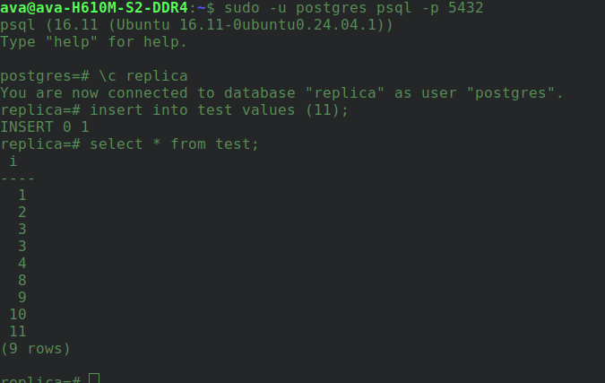
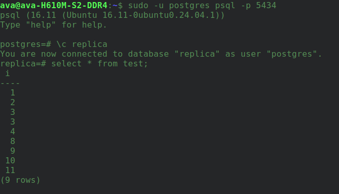

## Создаю кластер для логической репликации:
```
sudo pg_createcluster 16 replica_logic -p 5434
sudo pg_ctlcluster 16 replica_logic start;
```

Настройки мастера:

редактируем конфигурацию:
sudo nano /etc/postgresql/16/replica_logic/postgresql.conf 
устанавливаем значение wal_level на logical

перезапускаем кластер:
sudo pg_ctlcluster 16 replica_logic restart

Создаем новую таблицу
create table test (i int);

создаем публикацию
create publication test_pub for table test;

Настройки реплики:

Создаем базу данных и таблицу
create database replica;
create table test (i int);

создадим подписку
create subscription test_sub
connection 'host=127.0.0.1 port=5432 user=postgres password=fefd dbname=replica'
publication test_pub;

Вставляем данные на мастере и проверяем чтобы они появились на реплике:





