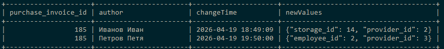

# Домашнее задание №23 . 

## Проанализировать типы данных в своем проекте, изменить при необходимости. В README указать что на что поменялось и почему.

## Таблица Номенклатура - nomenclatures

|Поле                | Было             | Стало             | Комментарий                                  |
|--------------------|------------------|-------------------|--------------------------------              |
| comment            | VARCHAR          | TEXT              | комментарий может быть достаточно длиинным   |  


## Таблица Номенклатура - purchase_invoices

|Поле                | Было             | Стало             | Комментарий                                  |
|--------------------|------------------|-------------------|--------------------------------              |
| date               | TIMESTAMP        | DATETIME          | Чтобы не было ситуаций из-за часового пояса  |


## Таблица приходов - parishes
|Поле                | Было             | Стало             | Комментарий                                  |
|--------------------|------------------|-------------------|--------------------------------              |
| price              | DOUBLE           | DECIMAL(10,2)     | для цен лучше использовать decimal           |
| manufacture_date   | DATE             | DATETIME          |                                              |
| good_until         | DATE             | DATETIME          |                                              |

## Таблица Номенклатура - expense_invoices

|Поле                | Было             | Стало             | Комментарий                                  |
|--------------------|------------------|-------------------|--------------------------------              |
| date               | TIMESTAMP        | DATETIME          | Чтобы не было ситуаций из-за часового пояса  |


## Таблица приходов - cancellations
|Поле                | Было             | Стало             | Комментарий                                  |
|--------------------|------------------|-------------------|--------------------------------              |
| price              | DOUBLE           | DECIMAL(10,2)     | для цен лучше использовать decimal           |
| manufacture_date   | DATE             | DATETIME          |                                              |
| good_until         | DATE             | DATETIME          |                                              |


## Добавить тип JSON в структуру. Проанализировать какие данные могли бы там хранится. привести примеры SQL для добавления записей и выборки.

>Можно создать таблицу для ведения истории изменений приходных накладных

```sql
DROP TABLE IF EXISTS purchase_invoice_change_log;

CREATE TABLE purchase_invoice_change_log (
    id INT NOT NULL AUTO_INCREMENT PRIMARY KEY,
    purchase_invoice_id INT NOT NULL,
    log JSON,
    FOREIGN KEY (purchase_invoice_id) REFERENCES purchase_invoices(id)
) ENGINE=InnoDB DEFAULT CHARSET=utf8mb4;

UPDATE purchase_invoices SET storage_id = 14, provider_id = 2 WHERE id = 185;
INSERT INTO purchase_invoice_change_log (purchase_invoice_id, log) VALUES 
    (185, '{"author": "Иванов Иван", "time": "2026-04-19 18:49:09", "newValues": {"storage_id": 14, "provider_id": 2}}');

UPDATE purchase_invoices SET employee_id = 2, provider_id = 3 WHERE id = 185;
INSERT INTO purchase_invoice_change_log (purchase_invoice_id, log) VALUES 
    (185, '{"author": "Петров Петя", "time": "2026-04-19 19:50:00", "newValues": {"employee_id": 2, "provider_id": 3}}');

SELECT 
    purchase_invoice_id,
    log->>'$.author' as author,
    log->>'$.time' as changeTime,
    log->>'$.newValues' as newValues
FROM purchase_invoice_change_log
WHERE purchase_invoice_id = 185;
```


    

