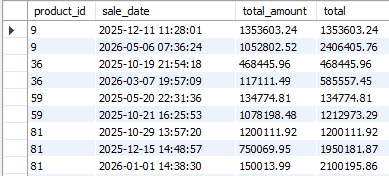
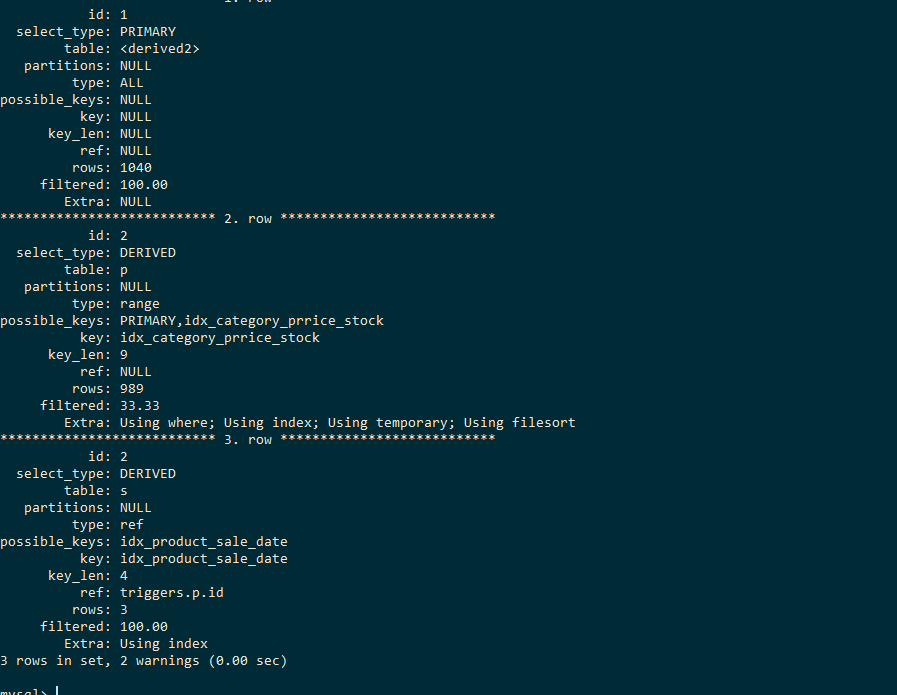

# Проанализировать план выполнения запроса, оценить, на чем теряется время.

## возьмите сложную выборку из предыдущих ДЗ с несколькими join и подзапросами

> запрос возвращает набегающий итог по продажам сгруппированным по товарам



```sql
WITH filtered_products AS (
    SELECT id
    FROM triggers.products p
    WHERE category_id IN (1,2,3)
    AND p.price > 110000
	AND stock_quantity > 200
),
group_by_product as (
	SELECT 
        s.product_id, 
        s.sale_date, 
        s.total_amount,
        sum(s.total_amount) OVER(PARTITION BY s.product_id ORDER BY s.sale_date) AS total
    FROM triggers.sales s
    JOIN filtered_products fp ON fp.id = s.product_id
)
SELECT * FROM group_by_product gp;
```

## постройте EXPLAIN в 3 формата

EXPLAIN:



EXPLAIN ANALYZE:
```
 -> Table scan on gp  (cost=2.5..2.5 rows=0) (actual time=27.2..27.3 rows=1861 loops=1)
    -> Materialize CTE group_by_product  (cost=0..0 rows=0) (actual time=27.2..27.2 rows=1861 loops=1)
        -> Window aggregate with buffering: sum(sales.total_amount) OVER (PARTITION BY s.product_id ORDER BY s.sale_date )   (actual time=24.7..26.8 rows=1861 loops=1)
            -> Sort: s.product_id, s.sale_date  (actual time=24.7..24.8 rows=1861 loops=1)
                -> Stream results  (cost=13556 rows=1502) (actual time=0.509..24.3 rows=1861 loops=1)
                    -> Nested loop inner join  (cost=13556 rows=1502) (actual time=0.501..24 rows=1861 loops=1)
                        -> Table scan on s  (cost=3044 rows=30034) (actual time=0.416..4.23 rows=30000 loops=1)
                        -> Filter: ((p.category_id in (1,2,3)) and (p.price > 110000.00) and (p.stock_quantity > 200))  (cost=0.25 rows=0.05) (actual time=598e-6..601e-6 rows=0.062 loops=30000)
                            -> Single-row index lookup on p using PRIMARY (id=s.product_id)  (cost=0.25 rows=1) (actual time=461e-6..478e-6 rows=1 loops=30000)
```

EXPLAIN FORMAT=JSON
```json
{
  "query_block": {
    "select_id": 1,
    "cost_info": {
      "query_cost": "171.36"
    },
    "table": {
      "table_name": "gp",
      "access_type": "ALL",
      "rows_examined_per_scan": 1501,
      "rows_produced_per_join": 1501,
      "filtered": "100.00",
      "cost_info": {
        "read_cost": "21.26",
        "eval_cost": "150.10",
        "prefix_cost": "171.36",
        "data_read_per_join": "58K"
      },
      "used_columns": [
        "product_id",
        "sale_date",
        "total_amount",
        "total"
      ],
      "materialized_from_subquery": {
        "using_temporary_table": true,
        "dependent": false,
        "cacheable": true,
        "query_block": {
          "select_id": 2,
          "cost_info": {
            "query_cost": "15057.25"
          },
          "windowing": {
            "windows": [
              {
                "name": "<unnamed window>",
                "using_filesort": true,
                "filesort_key": [
                  "`product_id`",
                  "`sale_date`"
                ],
                "frame_buffer": {
                  "using_temporary_table": true,
                  "optimized_frame_evaluation": true
                },
                "functions": [
                  "sum"
                ]
              }
            ],
            "cost_info": {
              "sort_cost": "1501.70"
            },
            "buffer_result": {
              "using_temporary_table": true,
              "nested_loop": [
                {
                  "table": {
                    "table_name": "s",
                    "access_type": "ALL",
                    "rows_examined_per_scan": 30034,
                    "rows_produced_per_join": 30034,
                    "filtered": "100.00",
                    "cost_info": {
                      "read_cost": "40.25",
                      "eval_cost": "3003.40",
                      "prefix_cost": "3043.65",
                      "data_read_per_join": "1M"
                    },
                    "used_columns": [
                      "id",
                      "product_id",
                      "sale_date",
                      "total_amount"
                    ]
                  }
                },
                {
                  "table": {
                    "table_name": "p",
                    "access_type": "eq_ref",
                    "possible_keys": [
                      "PRIMARY"
                    ],
                    "key": "PRIMARY",
                    "used_key_parts": [
                      "id"
                    ],
                    "key_length": "4",
                    "ref": [
                      "triggers.s.product_id"
                    ],
                    "rows_examined_per_scan": 1,
                    "rows_produced_per_join": 1501,
                    "filtered": "5.00",
                    "cost_info": {
                      "read_cost": "7508.50",
                      "eval_cost": "150.17",
                      "prefix_cost": "13555.55",
                      "data_read_per_join": "938K"
                    },
                    "used_columns": [
                      "id",
                      "category_id",
                      "price",
                      "stock_quantity"
                    ],
                    "attached_condition": "((`triggers`.`p`.`category_id` in (1,2,3)) and (`triggers`.`p`.`price` > 110000.00) and (`triggers`.`p`.`stock_quantity` > 200))"
                  }
                }
              ]
            }
          }
        }
      }
    }
  }
} 
```

## оцените план прохождения запроса, найдите самые тяжелые места

оцениваю через EXPLAIN ANALYZE
```
'-> Table scan on gp  (cost=2.5..2.5 rows=0) (actual time=30.2..30.3 rows=1861 loops=1)
    -> Materialize CTE group_by_product  (cost=0..0 rows=0) (actual time=30.2..30.2 rows=1861 loops=1)
        -> Window aggregate with buffering: sum(`triggers`.sales.total_amount) OVER (PARTITION BY `triggers`.s.product_id ORDER BY `triggers`.s.sale_date )   (actual time=28.4..30 rows=1861 loops=1)
            -> Sort: `triggers`.s.product_id, `triggers`.s.sale_date  (actual time=28.4..28.4 rows=1861 loops=1)
                -> Stream results  (cost=13556 rows=1502) (actual time=0.458..28 rows=1861 loops=1)
                    -> Nested loop inner join  (cost=13556 rows=1502) (actual time=0.452..27.6 rows=1861 loops=1)
                        -> Table scan on s  (cost=3044 rows=30034) (actual time=0.386..4.83 rows=30000 loops=1)
                        -> Filter: ((`triggers`.p.category_id in (1,2,3)) and (`triggers`.p.price > 110000.00) and (`triggers`.p.stock_quantity > 200))  (cost=0.25 rows=0.05) (actual time=694e-6..697e-6 rows=0.062 loops=30000)
                            -> Single-row index lookup on p using PRIMARY (id=`triggers`.s.product_id)  (cost=0.25 rows=1) (actual time=547e-6..563e-6 rows=1 loops=30000)
'
```

Узкие места:
-> Table scan on s  (cost=3044 rows=30034) (actual time=0.386..4.83 rows=30000 loops=1) - фул скан 30000 строк
-> Filter: ((`triggers`.p.category_id in (1,2,3)) and (`triggers`.p.price > 110000.00) and (`triggers`.p.stock_quantity > 200))  (cost=0.25 rows=0.05) (actual time=694e-6..697e-6 rows=0.062 loops=30000) - фильтрация в 30000 строках

Решение добавить покрывающий индекс для CTE group_by_product и покрывающий индекс на products для category_id, price, stock_quantity

Добавляем индексы:
alter table products add key idx_category_prrice_stock(category_id, price,stock_quantity);
alter table sales add key idx_product_sale_date(product_id, sale_date, total_amount);

Новый explain analyze

```
'-> Table scan on gp  (cost=2.5..2.5 rows=0) (actual time=4.7..4.81 rows=1861 loops=1)
    -> Materialize CTE group_by_product  (cost=0..0 rows=0) (actual time=4.7..4.7 rows=1861 loops=1)
        -> Window aggregate with buffering: sum(`triggers`.sales.total_amount) OVER (PARTITION BY `triggers`.s.product_id ORDER BY `triggers`.s.sale_date )   (actual time=2.79..4.51 rows=1861 loops=1)
            -> Sort: `triggers`.s.product_id, `triggers`.s.sale_date  (actual time=2.78..2.84 rows=1861 loops=1)
                -> Stream results  (cost=632 rows=1041) (actual time=0.031..2.41 rows=1861 loops=1)
                    -> Nested loop inner join  (cost=632 rows=1041) (actual time=0.0283..2.06 rows=1861 loops=1)
                        -> Filter: ((`triggers`.p.category_id in (1,2,3)) and (`triggers`.p.price > 110000.00) and (`triggers`.p.stock_quantity > 200))  (cost=201 rows=330) (actual time=0.0199..0.408 rows=612 loops=1)
                            -> Covering index range scan on p using idx_category_prrice_stock over (category_id = 1 AND 110000.00 < price) OR (category_id = 2 AND 110000.00 < price) OR (category_id = 3 AND 110000.00 < price)  (cost=201 rows=989) (actual time=0.0182..0.259 rows=989 loops=1)
                        -> Covering index lookup on s using idx_product_sale_date (product_id=`triggers`.p.id)  (cost=0.993 rows=3.16) (actual time=0.00191..0.00244 rows=3.04 loops=612)
'
```

Что улучшилось:
1. Было Table scan on s rows=30000 стало Covering index lookup on s loops=612. Вместо чтения всех продаж, ищем продажи для 612 товаров
2. Было Single-row index lookup on p loops=30000, стало Covering index range scan on p rows=989. То есть вместо 30 000 обращений к products, сразу используется составной индекс:

