# Научиться разворачивать MongoDB, заполнять данными и делать запросы.

## установить MongoDB одним из способов: ВМ, докер;

Установил через docker, вот мой docker-compose.yml
```yml
services:
  mongodb:
    image: mongo:7
    container_name: mongodb
    restart: unless-stopped

    ports:
      - "27017:27017"

    volumes:
      - mongo_data:/data/db

volumes:
  mongo_data:
```

Подключился через compas
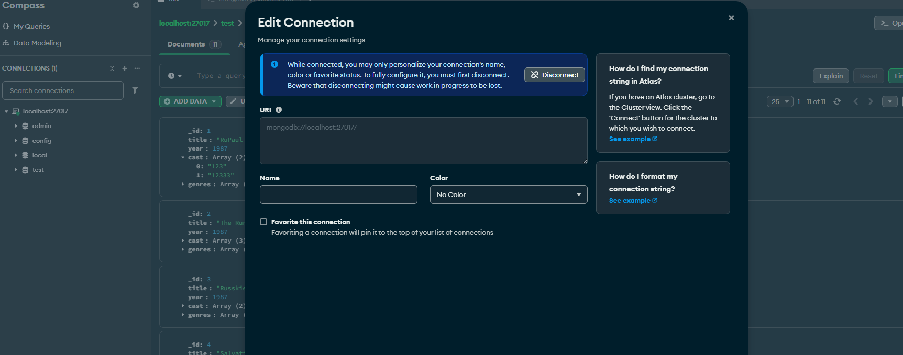

## заполнить данными

Заполнил через файл прикрепленный в лекции с использванием Compas

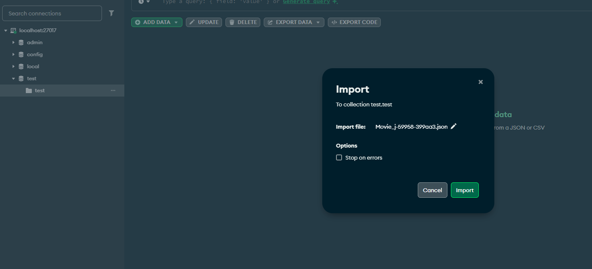

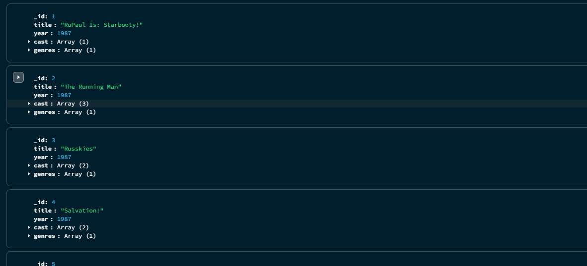


## написать несколько запросов на выборку и обновление данных

запрос на вставку нескольких новых записей
```js
db.test.insertMany([
  {
    _id: 11,
    title: "Home Alone",
    year: 1990,
    cast: ["Macaulay Culkin", "Joe Pesci"],
    genres: ["Comedy"]
  },
  {
    _id: 12,
    title: "Terminator 2",
    year: 1991,
    cast: ["Arnold Schwarzenegger", "Linda Hamilton"],
    genres: ["Action", "Science Fiction"]
  }
])
```

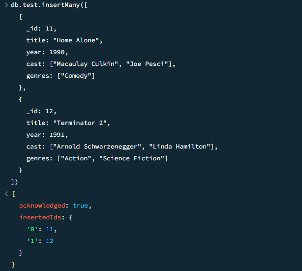

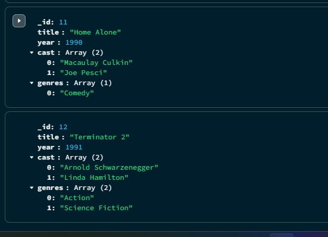


запрос на обновление одной записи

```js
db.test.updateOne(
  { _id: 1 },
  { $set: { title: "RuPaul Is: Starbooty", year: 1988 } }
)
```

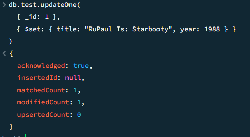

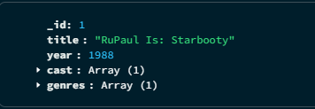


обновление нескольких записей

```js
db.test.updateMany(
  { genres: "Comedy" },
  { $set: { popularGenre: true } }
)
```

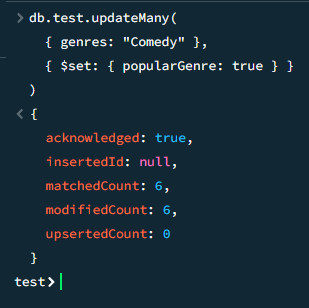

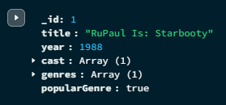

запрос на поиск фильмов 1987 года
```js
db.test.find({ year: 1987 })
```

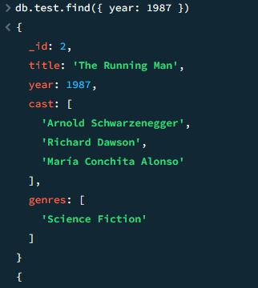

запрос на поиск высх фильмов жанра комедии
```js
db.test.find({ genres: "Comedy" })
```

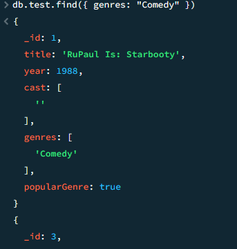

запрос на поиск фильмов с 1987 по 1989 годы
```js
db.test.find({
  year: { $gte: 1987, $lte: 1989 }
})
```

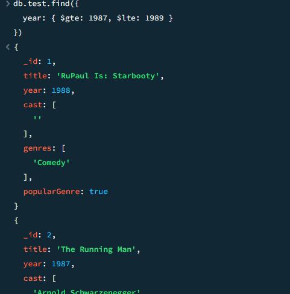